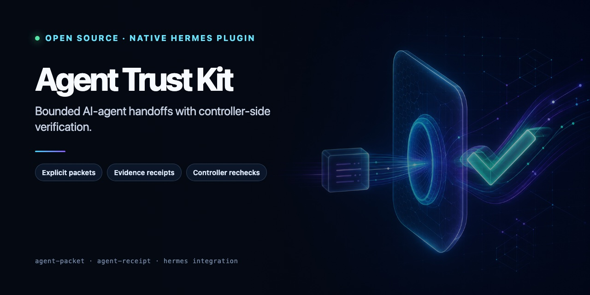
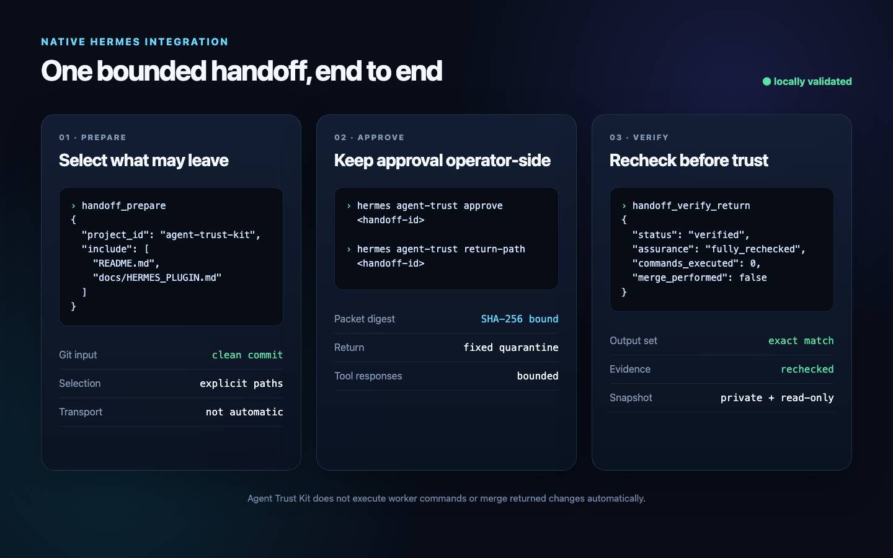

<p align="center">
  
</p>

# Agent Trust Kit

**Make every AI-agent handoff explicit: select what leaves, record what returns,
and recheck evidence before you trust or merge it.**

[](https://github.com/mauricemohr88-debug/agent-trust-kit/actions/workflows/ci.yml)
[](https://github.com/mauricemohr88-debug/agent-trust-kit/actions/workflows/codeql.yml)
[](LICENSE)
[](pyproject.toml)

Delegating code is easy. Keeping the handoff narrow—and deciding whether the
returned result deserves trust—is the hard part. Agent Trust Kit gives the
controller an inspectable packet, an explicit evidence record, and an
independent verification step.

| Tool | Boundary it adds |
|---|---|
| [`agent-packet`](packages/agent-packet/) | Builds an allowlist-based handoff archive and rejects known private paths, links, unsafe archive structures, and secret-like text. |
| [`agent-receipt`](packages/agent-receipt/) | Records claims and evidence, then lets a controller repeat explicitly selected checks inside a controller-chosen workspace. |
| [Native Hermes plugin](docs/HERMES_PLUGIN.md) | Adds project registration, operator approval, a fixed return quarantine, and controller-owned verification. |

The intended flow is:

```text
trusted controller -> inspectable packet -> remote worker
trusted controller <- changes + receipt <- remote worker
trusted controller -> independent checks -> accept or reject
```

## Start here

- [Follow the complete Hermes/OpenClaw handoff](docs/HERMES_OPENCLAW_FLOW.md)
- [Install and use the native Hermes plugin](docs/HERMES_PLUGIN.md)
- [Understand the security boundary](THREAT_MODEL.md)
- [Review the local validation record](docs/LOCAL_VALIDATION.md)

This is the **first public source release**. The tools reduce common handoff
mistakes; they do not send packets, sandbox workers, control every Hermes tool,
guarantee that sensitive data is absent, prove that a worker was honest, or
merge returned changes automatically.

## Development

Requirements: Python 3.10+ and [uv](https://docs.astral.sh/uv/).

```bash
uv sync --all-packages --group dev
uv run ruff check .
uv run ruff format --check .
uv run pytest -q
```

Package-specific instructions and examples live in each package README. The
[Hermes/OpenClaw walkthrough](docs/HERMES_OPENCLAW_FLOW.md) shows the complete
handoff and independent verification boundary.

## Native Hermes integration

<p align="center">
  
</p>

The repository root is also a Hermes plugin. It exposes `handoff_prepare`,
`handoff_status`, and `handoff_verify_return`, while keeping approval and local
paths on the operator-facing `hermes agent-trust` CLI. Prepare accepts only a
registered Git project, explicit include paths, and a clean input commit.
Verification uses a fixed private quarantine, requires
`OUTPUT_MANIFEST.json` plus `receipt.json`, performs a full recheck without
executing worker commands, and never merges automatically.

Install the public repository with:

```bash
hermes plugins install mauricemohr88-debug/agent-trust-kit --enable
hermes agent-trust project add my-project /path/to/git/project
hermes agent-trust doctor
```

The plugin is not a global egress gate or OS sandbox. Other Hermes tools, manual
transfers, unrestricted same-user terminal access, and a compromised host remain
outside its boundary. Read [the plugin guide](docs/HERMES_PLUGIN.md) and the
[threat model](THREAT_MODEL.md) before using it with private work.

## Want help applying this to a real workflow?

The code and local verification tools are MIT-licensed. If you want a human
review of one concrete agent handoff, the
[149 € founding pilot](docs/FOUNDING_PILOT_DE.md) includes a prioritized short
report, a workflow-specific include/deny policy, one reproducible controller
check, and a 30-minute results handoff.

This is a fixed-scope review service—not SaaS, a penetration test,
certification, or a guarantee against secrets or malicious workers. The
[German intake](docs/PILOT_INTAKE_DE.md) fixes the scope before work starts.

## Relationship to Hermes Plugin Guard

[Hermes Plugin Guard](https://github.com/mauricemohr88-debug/hermes-plugin-guard)
remains a separate project: it examines a plugin before activation. These tools
cover the later handoff boundary. They may be used together but have independent
release and support cycles.

## Status

- This working tree is prepared for its first public source push;
  `agent-packet` and `agent-receipt` are not yet published on PyPI.
- Local lint, the Python 3.10–3.14 test matrix, package builds, wheel-install
  smoke, and the end-to-end handoff are green; see the
  [local validation record](docs/LOCAL_VALIDATION.md).
- Remote GitHub CI/CodeQL will be checked immediately after the first push. One real
  non-sensitive dogfood workflow, feedback from two outside testers, and
  separate PyPI approval remain before public package publication.

MIT licensed. See [SECURITY.md](SECURITY.md) for responsible reporting.
